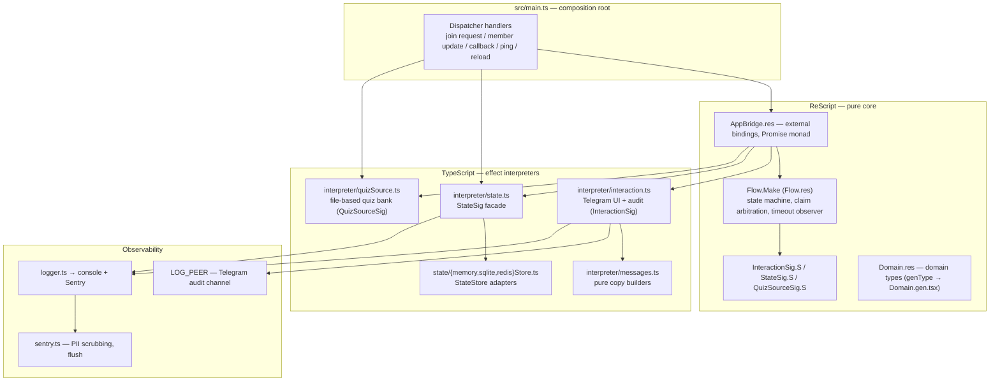

# Module Map

## System at a glance

`genshin-group-verif` is a Telegram bot that verifies humans joining a group:
a new entrant must answer a randomly selected quiz question before a deadline.
The core decision logic is a pure ReScript state machine; every side effect is
implemented in TypeScript behind three effect signatures. See
[CONTEXT.md](../../CONTEXT.md) for the domain vocabulary and
[ADR-0002](../adr/0002-rescript-core-typescript-interpreters.md) for why the
code is split across two languages.

Two paths are worth noting because they **do not** go through the ReScript
bridge:

- `main.ts:11,169-172` imports `stateStore()` and calls
  `stateStore().session.listAll()` directly for restart recovery.
- `main.ts:9,52` imports `initQuizBank()` from `quizSource.ts` directly for
  startup initialization.

## File inventory

LOC counts are from commit `83d9392` (`wc -l`). "Interface implemented" names
the seam a module sits behind.

| File | Lang | LOC | Role | Interface |
| --- | --- | --- | --- | --- |
| `src/main.ts` | TS | 175 | Composition root: client, dispatcher, handlers, crash policy, restart recovery | none (top-level wiring) |
| `src/Flow.res` | ReScript | 273 | `Flow.Make` functor: the verification state machine | `startVerification`, `handleCallback`, `armTimeoutObserver` |
| `src/Domain.res` | ReScript | 90 | Domain types (`context`, `decision`, `log_kind`, `session`, `quiz`, …) | genType surface → `Domain.gen.tsx` |
| `src/Domain.gen.tsx` | TS (generated) | 70 | Type-level bridge of domain types for TS | generated |
| `src/InteractionSig.res` | ReScript | 39 | Signature of Telegram UI/audit effects | `InteractionSig.S` |
| `src/StateSig.res` | ReScript | 28 | Signature of cooldown/session state effects | `StateSig.S` |
| `src/QuizSourceSig.res` | ReScript | 10 | Signature of quiz effects | `QuizSourceSig.S` |
| `src/AppBridge.res` | ReScript | 134 | Binds TS interpreter exports to the three signatures; instantiates `Flow.Make` | external name strings |
| `src/Utils.res` | ReScript | 16 | `randomUUID`, Fisher–Yates shuffle, `discard` | small helpers |
| `src/interpreter/task.ts` | TS | 10 | Promise monad instance (`pure`/`bind`) | shared by all three signatures |
| `src/interpreter/interaction.ts` | TS | 267 | `InteractionSig.S` adapter over mtcute; LOG_PEER audit | 8 exported `interaction_*` functions |
| `src/interpreter/messages.ts` | TS | 48 | Pure builders for challenge/audit copy | pure functions |
| `src/interpreter/state.ts` | TS | 95 | `StateSig.S` facade: store factory, cooldown, sessions, timeout peek | 7 exported `session_*`/`cooldown_*` functions |
| `src/interpreter/state/store.ts` | TS | 89 | `StateStore` interface, envelope serialization, lookup key | `StateStore` |
| `src/interpreter/state/factory.ts` | TS | 16 | Backend selection by config | `createStore` |
| `src/interpreter/state/memoryStore.ts` | TS | 87 | memory adapter (TTLMap) | `StateStore` |
| `src/interpreter/state/sqliteStore.ts` | TS | 174 | sqlite adapter (`node:sqlite`, `BEGIN IMMEDIATE`) | `StateStore` |
| `src/interpreter/state/redisStore.ts` | TS | 152 | redis adapter (ioredis, Lua claim) | `StateStore` |
| `src/interpreter/state/storeContract.ts` | TS | 184 | Shared 11-test conformance suite for every backend | test-only |
| `src/interpreter/ttlMap.ts` | TS | 66 | TTL map with sweeps (memory backend) | internal |
| `src/interpreter/quizSource.ts` | TS | 70 | File-based quiz bank, load/reload | `quiz_getRandom`, `quiz_reload`, `initQuizBank` |
| `src/interpreter/runtime.ts` | TS | 14 | Global `_tg` client holder + `setRuntime` | internal |
| `src/interpreter/peer.ts` | TS | 8 | Numeric peer casts + `peerKey` | internal |
| `src/joinPolicy.ts` | TS | 20 | Admin-added-member bypass, fail-closed | `wasAddedByAdmin` |
| `src/env.ts` | TS | 47 | Hand-rolled env parsing/validation | `env` object |
| `src/logger.ts` | TS | 60 | Single logging entry (console + Sentry sinks) | `logger.debug/info/warn/error` |
| `src/sentry.ts` | TS | 113 | Sentry init, PII scrubbing, `captureError`, `flushSentry` | internal |
| `src/FlowTest.res` | ReScript | 531 | Flow state-machine tests (17 tests) | test-only |
| `src/MockInterpreter.res` | ReScript | 293 | Identity-monad mock of all three signatures | test-only |
| `src/interpreter/messages.test.ts` | TS | 69 | Copy builder tests (6 tests) | test-only |
| `src/interpreter/ttlMap.test.ts` | TS | 64 | TTLMap tests (5 tests) | test-only |
| `src/interpreter/state/*.test.ts` | TS | 4/4/23 | Contract runs for memory / sqlite / redis (33 tests) | test-only |
| `build.mjs` | JS | 90 | Production esbuild pipeline | CLI |
| `Dockerfile` | — | 34 | 3-stage production image | — |
| `docker-compose.yaml` | — | 10 | `bot` service, `restart: always`, volume mount | — |
| `.env.example` | — | 14 | Example env file (incomplete, see 06) | — |

## Dependency and control flow

- `main.ts` is the only composition root. It constructs `TelegramClient`,
  `Dispatcher`, registers five handler groups, and starts the client.
- `AppBridge.res` is a pure forwarding layer: ReScript `external` bindings
  (`AppBridge.res:3-68`) call named exports in `interpreter/*.js`, then three
  module values (`Interaction`, `State`, `QuizSource`) implement the signatures
  and `Flow.Make(Interaction)(State)(QuizSource)` produces `App`
  (`AppBridge.res:70-134`).
- `Flow.res` never imports mtcute. Its only external world is the three
  signatures plus `Domain`/`Utils`.
- The TS interpreters are adapters: `interaction.ts` over mtcute,
  `state.ts` over `StateStore`, `quizSource.ts` over the file system.
- Observability is a side channel: `logger.ts` fans out to console and
  `sentry.ts`; `interaction_logActivity` additionally writes to LOG_PEER
  (`interaction.ts:181-200`).

## Hotspots from git history

`git log` across all 16 commits shows the files that keep changing:

| Area | Files | Why it is hot |
| --- | --- | --- |
| Telegram adapter | `interaction.ts`, formerly `InterpreterMtCute.ts` | Most commits: interpreter creation, split, challenge send fixes, log surface |
| State machine + claim | `Flow.res`, `StateSig.res`, `AppBridge.res` | Lifecycle rework around atomic claim (`cd2a62f`) |
| State backends | `state/*` | `6c84b1c` introduced the pluggable StateStore |
| Logging | `logger.ts`, `sentry.ts`, `joinPolicy.ts`, `main.ts` | `83d9392` Sentry + logger unification |

These four areas are exactly where the behavior docs concentrate their depth.

## Build and type-generation chain

1. `pnpm res:build` (`rescript`, config `rescript.json`) compiles every `.res`
   file in `src/` **in-source** to `src/*.res.mjs`; genType emits
   `src/Domain.gen.tsx`. The `.res.mjs` outputs are git-ignored
   (`.gitignore` last entry `*.res.mjs`).
2. TS consumes domain types via `Domain.gen.tsx`; runtime TS code imports
   compiled `*.res.mjs` modules only in `main.ts` (`AppBridge.res.mjs`).
3. `build.mjs` runs ReScript, then bundles `src/main.ts` with esbuild into
   `dist/main.mjs` (+ sourcemap, metafile), with `better-sqlite3` external and
   `.wasm` emitted as files. It then copies `bot-data/quizzes.json` into
   `dist/` — this copy step currently fails on a clean checkout (see
   [06-deployment.md](06-deployment.md) and [08-risk-register.md](08-risk-register.md)).

## Reading paths for newcomers

**One request, end to end:** `main.ts` handler → `AppBridge.App` →
`Flow.startVerification` → `InteractionSig`/`StateSig`/`QuizSourceSig`
implementations in `interpreter/` → store backends.

**Domain first:** `CONTEXT.md` → `Domain.res` → `Flow.res` →
`FlowTest.res`.

**Seam work:** `InteractionSig.res`/`StateSig.res`/`QuizSourceSig.res` →
`AppBridge.res` → corresponding `interpreter/*.ts`.

**Persistence work:** `state/store.ts` contract → `storeContract.ts` →
one backend → the other two backends, diffing semantics against the contract.
