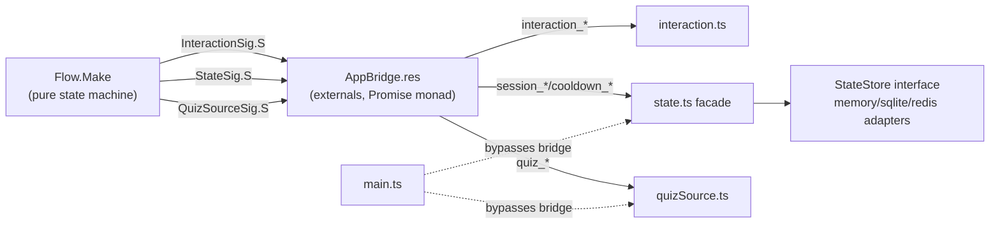

# Seams and Interfaces

This document is the P1 reference for the four interfaces around the pure
core: `AppBridge` (the language bridge), `InteractionSig`, `StateSig`, and
`QuizSourceSig`. Architecture vocabulary — `module`, `interface`, `seam`,
`adapter`, `depth`, `leverage`, `locality` — is used in the codebase-design
sense.

## Seam overview

Three seams are *external* to the state machine (the three `.res` signatures);
two additional seams sit inside the TypeScript side (`StateStore`, and the
`setRuntime`/`tg()` handoff). `main.ts` also crosses the bridge seam directly
for restart recovery and quiz initialization — a partial bypass of
`StateSig.S`/`QuizSourceSig.S`.

## The AppBridge language bridge

`AppBridge.res` is the only module that names concrete interpreter files.

- Each effect is an `external` binding to a named export:
  `@module("./interpreter/interaction.js") external presentChallengeImpl … = "interaction_presentChallenge"`
  (`AppBridge.res:9-68`). The compiled `.res.mjs` calls
  `InteractionJs.interaction_presentChallenge(...)`.
- Three module values implement the signatures with
  `type t<'a> = promise<'a>` (`AppBridge.res:70-132`), using `task.ts`'s
  `pure`/`bind` (`task.ts:6-9`). `Flow.Make` is instantiated at
  `AppBridge.res:134`.
- `main.ts` imports the compiled `AppBridge.res.mjs` directly
  (`main.ts:6`); tsconfig has `allowJs: true` but not `checkJs`
  (`tsconfig.json:9`), so **TypeScript cannot type-check the ReScript side of
  the bridge**.

The bridge's true interface therefore includes facts no compiler sees:

1. **Export-name contract.** TS export names must exactly match the
   `external` string names. `state.ts:5-6` documents this as "keep them
   stable". Renaming a TS export produces `undefined is not a function` at
   runtime.
2. **Parameter order and arity.** e.g. `enforceDecisionImpl(chatId, userId,
   decision, context)` (`AppBridge.res:26,84-85`) must match
   `interaction_enforceDecision(chatId, userId, dec, ctx)`
   (`interaction.ts:128`).
3. **Type-representation contract.** `Domain.gen.tsx` maps ReScript `option`
   to `undefined`, tuples to JS arrays, `Peer.id` to `number`, and
   `CallbackQuery.id` to `BigInt` (`Domain.gen.tsx:22-39`). In production,
   `queryId` is actually an mtcute `Long` smuggled through a double cast
   (`main.ts:147`) and passed as `any` (`interaction.ts:111-114`); the
   generated `BigInt` type is a lie at this edge.
4. **Failure contract.** The interpreters must not reject (see below) —
   stated only in comments (`Flow.res:112-113`, `interaction.ts:176-179`),
   not in the signature.

## `InteractionSig.S` contract

Signature: `InteractionSig.res:7-39`. Production adapter:
`interaction.ts`. Global precondition: `setRuntime(tg)` must have run
(`runtime.ts:9-13`, `main.ts:51`).

| Method | Parameters | Return | Preconditions / notes | Error mode |
| --- | --- | --- | --- | --- |
| `presentChallenge` | `chatId`, `userId`, `userFirstName`, `question`, `options: (label, token)[]`, `timeoutSec` | `option<Message.location>` | Renders `timeoutSec` into the copy so text matches behavior (`InteractionSig.res:7-8`). One button per option; button data is the token (`interaction.ts:41-53`). | Catches send failure, logs error, returns `None` (`interaction.ts:54-57`). `None` means the caller must settle as failure. Never rejects. |
| `updateStatus` | `loc`, `status` | `unit` | Edits the challenge message and removes the inline keyboard (`interaction.ts:63-103`). | `MESSAGE_NOT_MODIFIED` → silent. `REPLY_MARKUP_INVALID` → retry without markup. Other errors → logged. Never rejects. |
| `acknowledgeClick` | `queryId`, `text`, `showAlert` | `unit` | Answers a callback query (`interaction.ts:109-121`). | Catches and logs. Never rejects. |
| `enforceDecision` | `chatId`, `userId`, `decision`, `context` | `unit` | `Grant_access`: lift restrictions (`In_group`, `interaction.ts:135-141`) or approve (`Join_request`, `144-148`). `Punish_soft`: 60s ban/kick (`152-158`) or decline (`160-165`). | **Catches and logs Telegram errors, then resolves as if enforced** (`interaction.ts:168-170`). Callers cannot distinguish success from failure. |
| `logActivity` | `kind`, `chatId`, `userId` | `unit` | Console info + LOG_PEER audit message (`interaction.ts:181-200`). | Every Telegram call is inside the try; failures are logged and swallowed (`interaction.ts:197-199`). The `logger.info` call at `184` is outside the try but cannot realistically throw. |
| `sendTempMessage` | `chatId`, `text` | `unit` | Sends a notice; schedules self-deletion after 10s (`interaction.ts:208-219`). | Send failure logged; scheduled delete failure logged at debug. Never rejects. |
| `scheduleMessageCleanup` | `loc`, `delaySec` | `unit` | Schedules deletion via `setTimeout` (`interaction.ts:224-231`). | Returns immediately; delete failure logged at debug. Never rejects. |
| `restrictUser` | `chatId`, `userId` | `unit` | Restricts all message/media/invite permissions (`interaction.ts:238-266`). **No `until` parameter → permanent restriction** (mtcute default `until = 0`, i.e. forever). | Errors (e.g. basic groups) logged and swallowed (`interaction.ts:264-266`). Never rejects, but may silently not restrict. |

Consequences the Flow relies on:

- Every `InteractionSig` method resolves — the Flow effect chain is never
  severed by a Telegram error.
- The **only** method whose failure changes the domain flow is
  `presentChallenge` via `None`.
- `enforceDecision` resolving does not mean the decision took effect; Flow
  logs the audit event regardless (see
  [02-behavior-and-invariants.md](02-behavior-and-invariants.md) INV-10).

## `StateSig.S` contract

Signature: `StateSig.res:6-27`. Production adapter: `interpreter/state.ts`,
which delegates to the `StateStore` interface (`store.ts:16-55`).

| Method | Parameters | Return | Contract notes |
| --- | --- | --- | --- |
| `Cooldown.check` | `chatId`, `userId` | `bool` | Key is `"chatId:userId"` (`peer.ts:6-8`, `state.ts:57-59`). |
| `Cooldown.apply` | `chatId`, `userId`, `durationSec` | `unit` | Facade converts to ms (`state.ts:61-63`). Can reject on backend error. |
| `Session.save` | `session` | `unit` | Facade applies `SESSION_TTL_MS = 5min` (`state.ts:18,67-69`). Can reject. |
| `Session.findByToken` | `token` | `option<session>` | Any option token, not just the correct one (`store.ts:31`, `memoryStore.ts:38-39`). |
| `Session.findPending` | `chatId`, `userId` | `option<session>` | Newest wins on overwrite (`store.ts:26-28`). |
| `Session.claim` | `sessionId` | `option<session>` | The terminal-state gate. "Atomic claim: take out + delete everything (session + lookup + token_map). Terminal transitions must claim first; `None` means a concurrent path already handled it" (`StateSig.res:16-19`). Contract and ADR: [ADR-0001](../adr/0001-claim-first-settlement.md). |
| `Session.updateLocation` | `session`, `loc` | `unit` | Update-if-present; never resurrects a claimed session (`StateSig.res:21-22`; store contract `store.ts:39-45`). Returns `unit`, so the caller cannot tell whether the session was still live (relevant to audit ordering, INV-10). |
| `Session.waitAndPeek` | `sessionId`, `delaySec` | `option<session>` | Wait, then peek. `None` means already handled; the final arbiter remains claim (`StateSig.res:24-26`; `state.ts:41-53`). **Can reject** on backend errors. |

### The double surface: `StateSig.S` vs `StateStore`

`state.ts` is a facade: every store-touching method is a one-line delegation
(`state.ts:57-95`); only `session_waitAndPeek` contains behavior (the 60s
timer + peek). `StateSig.S` lacks `getById` and `listAll`, while `StateStore`
has both (`store.ts:30,47`). `main.ts:169-172` reaches around the ReScript
seam and calls `stateStore().session.listAll()` directly for recovery.

Two interfaces must therefore be learned and kept in sync for one concept
(session state). Contract details for `StateStore` itself — composite `save`,
atomic `claim`, TTL semantics, `close` — are in
[04-state-backends.md](04-state-backends.md).

## `QuizSourceSig.S` contract

Signature: `QuizSourceSig.res:7-9`. Production adapter:
`quizSource.ts`.

| Method | Parameters | Return | Notes |
| --- | --- | --- | --- |
| `getRandom` | `unit` | `option<quiz>` | `None` when the bank is empty (`quizSource.ts:54-58`); otherwise uniform-ish random via `Math.random`. |
| `reload` | `unit` | `result<unit, string>` | Reloads from `bot-data/quizzes.json`; on failure returns `Error(message)` **and keeps the previous bank** (`quizSource.ts:60-69`). |

Not on the signature, but part of the real interface:

- `initQuizBank()` must be called once at startup (`quizSource.ts:44-52`,
  called at `main.ts:52`). On failure it logs and installs an **empty** bank;
  every verification then bails as "service unavailable".
- `QUIZ_FILE_PATH` is resolved from `process.cwd()` (`quizSource.ts:21`).
- No validation: `CorrectOptionIndex` range and non-empty `Options` are
  assumed, not checked (`quizSource.ts:25-32`). The invariant lives implicitly
  in `Flow.prepareQuiz`'s `Array.getUnsafe` (`Flow.res:27`).

## Interface depth assessment

Using the codebase-design measure — behavior exercised per unit of interface
a caller must learn:

| Module | Depth assessment |
| --- | --- |
| `Flow.Make` | **Deep.** Two real entry points (`startVerification`, `handleCallback`) hide the full lifecycle, claim arbitration, timeout fork, cooldown, cleanup, and audit sequencing behind a tiny surface. Tests exercise the same surface (`FlowTest.res`). |
| `AppBridge` | **Shallow, but earns its keep.** 134 lines of pure forwarding; its interface (20 name strings + parameter orders) is nearly as complex as the implementation. The deletion test says it must stay, but its real interface is invisible to both compilers. |
| `interaction.ts` | **Moderate depth, hidden error contract.** The signature surface is small, but every method's *will never reject* and *enforcement failure is invisible* semantics live in comments, not in the interface. |
| `state.ts` facade | **Shallow.** Six one-line delegates plus `waitAndPeek`; the caller must still learn `StateStore` for `listAll` (recovery path). |
| `StateStore` | **Deep where it matters.** Composite `save`/`claim` hide per-backend atomicity; 11 conformance tests per backend are the test surface. The uncovered divergences are listed in 04. |
| `quizSource.ts` | **Moderate.** Small interface, but the adapter creates its own dependency (hardcoded cwd path, module-level mutable bank) and has no test seam. |

## Test seams and mock fidelity

`MockInterpreter.res` implements all three signatures with the **identity
monad** `t<'a> = 'a` (`MockInterpreter.res:141-145,190-194,266-270`), a
synchronous trace, and in-memory maps. This makes the Flow tests deterministic
but changes three semantics:

| Aspect | Mock | Production |
| --- | --- | --- |
| Monad | synchronous value | `Promise` (`task.ts:6-9`) — await points allow interleaving and rejection |
| `waitAndPeek` | immediately `None` (`MockInterpreter.res:259-262`) | 60s timer then `getById` (`state.ts:41-53`) |
| `updateLocation` | unconditional write — **can resurrect** a claimed session (`MockInterpreter.res:253-257`) | update-if-present in all real backends |
| `restrictUser` / failures | never fails | Telegram/backend failures possible |
| Cooldown | set without expiry (`MockInterpreter.res:77,204-208`) | TTL-backed |

Consequences: the full observer chain, the claim/`updateLocation` race, and
any rejection semantics are untestable with the current mock. See
[07-testing.md](07-testing.md) for the gap list.
